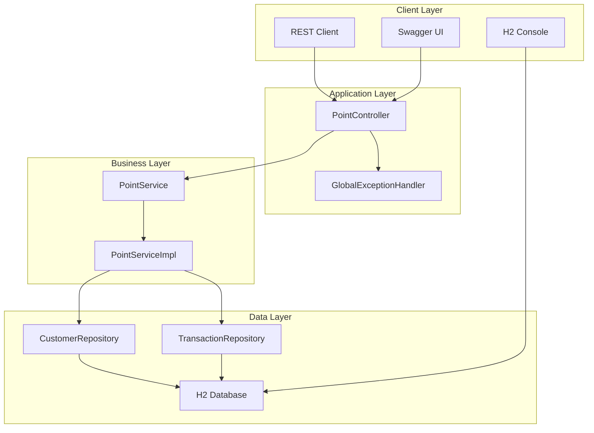

# Point Backend System

🎆 **Sistema backend Spring Boot per la gestione di punti cliente con operazioni di add/subtract**

[](https://openjdk.java.net/projects/jdk/17/)
[](https://spring.io/projects/spring-boot)
[](https://maven.apache.org/)
[](LICENSE)

---

## 🚀 Quick Start

```bash
# Clone repository
git clone https://github.com/lorenzomariabruni/point-backend.git
cd point-backend

# Avvia l'applicazione
./mvnw spring-boot:run
```

✨ **L'applicazione sarà disponibile su:** `http://localhost:8080`

---

## 📚 Documentazione Completa

### 📌 Indice Documentazione

| Documento | Descrizione | Link |
|-----------|-------------|---------|
| **📋 Documentazione Principale** | Guida completa con UML e diagrammi | [docs/README.md](docs/README.md) |
| **🏗️ Architettura** | Diagrammi architetturali e design patterns | [docs/ARCHITECTURE.md](docs/ARCHITECTURE.md) |
| **🧪 Testing API** | Test suite e scenari completi | [docs/API_TESTING.md](docs/API_TESTING.md) |

---

## ⚡ Quick Test

### Aggiungere Punti
```bash
curl -X POST http://localhost:8080/api/points/add \
  -H "Content-Type: application/json" \
  -d '{
    "customerId": 1,
    "points": 50,
    "description": "Acquisto prodotto premium"
  }'
```

### Sottrarre Punti
```bash
curl -X POST http://localhost:8080/api/points/subtract \
  -H "Content-Type: application/json" \
  -d '{
    "customerId": 1,
    "points": 25,
    "description": "Riscatto regalo"
  }'
```

### Consultare Saldo
```bash
curl -X GET http://localhost:8080/api/points/customer/1/balance
```

---

## 📈 Caratteristiche Principali

- ✅ **API RESTful** con documentazione Swagger
- ✅ **Validazione robusta** dei dati di input
- ✅ **Gestione transazionale** per consistenza dei dati
- ✅ **Audit completo** di tutte le operazioni
- ✅ **Pattern enterprise** (Repository, Service, DTO)
- ✅ **Gestione errori centralizzata**
- ✅ **Database H2** con console integrata

---

## 🔗 Collegamenti Utili

| Servizio | URL | Descrizione |
|----------|-----|-------------|
| **API Endpoints** | `http://localhost:8080/api/points/*` | API principali del sistema |
| **Swagger UI** | `http://localhost:8080/swagger-ui/` | Documentazione API interattiva |
| **Console H2** | `http://localhost:8080/h2-console` | Interfaccia database |
| **Health Check** | `http://localhost:8080/actuator/health` | Stato dell'applicazione |
| **Metrics** | `http://localhost:8080/actuator/metrics` | Metriche di performance |

---

## 📊 API Endpoints

| Metodo | Endpoint | Descrizione |
|--------|----------|-------------|
| **POST** | `/api/points/add` | Aggiunge punti al saldo cliente |
| **POST** | `/api/points/subtract` | Sottrae punti dal saldo cliente |
| **GET** | `/api/points/customer/{id}/balance` | Ottiene saldo attuale cliente |
| **GET** | `/api/points/customer/{id}/transactions` | Storico transazioni cliente |

---

## 📄 Dati di Test Preconfigurati

| ID | Nome | Email | Punti Iniziali |
|----|------|-------|----------------|
| 1 | Mario Rossi | mario.rossi@email.com | 100 |
| 2 | Giulia Bianchi | giulia.bianchi@email.com | 250 |
| 3 | Luca Verdi | luca.verdi@email.com | 0 |
| 4 | Anna Neri | anna.neri@email.com | 500 |

---

## 🔧 Tecnologie

### Core Framework
- **Spring Boot 3.2.0** - Framework principale
- **Spring Data JPA** - Persistenza dati
- **Spring Web** - API REST
- **H2 Database** - Database in-memory

### Qualità & Testing
- **Bean Validation (JSR-303)** - Validazione input
- **Swagger/OpenAPI** - Documentazione API
- **Spring Actuator** - Monitoraggio
- **Maven** - Build e dependency management

---

## 🎨 Architettura



---

## 🛠️ Configurazione Database

### Accesso Console H2
- **URL**: `jdbc:h2:mem:testdb`
- **Username**: `sa`
- **Password**: (vuota)
- **Console**: `http://localhost:8080/h2-console`

### Schema Database
```sql
-- Tabella clienti
CREATE TABLE customers (
    id BIGINT PRIMARY KEY AUTO_INCREMENT,
    name VARCHAR(255) NOT NULL,
    email VARCHAR(255) NOT NULL UNIQUE,
    points INTEGER NOT NULL DEFAULT 0,
    created_at TIMESTAMP NOT NULL,
    updated_at TIMESTAMP
);

-- Tabella transazioni
CREATE TABLE point_transactions (
    id BIGINT PRIMARY KEY AUTO_INCREMENT,
    customer_id BIGINT NOT NULL,
    transaction_type VARCHAR(50) NOT NULL,
    points INTEGER NOT NULL,
    description VARCHAR(500),
    created_at TIMESTAMP NOT NULL
);
```

---

## 🚀 Deploy & Produzione

### Requisiti di Sistema
- **Java**: 17+
- **Memory**: 512MB RAM minimo
- **Storage**: 100MB spazio disco

### Variabili Ambiente
```bash
# Configurazione server
export SERVER_PORT=8080

# Configurazione database (per produzione)
export DB_URL=jdbc:postgresql://localhost:5432/pointdb
export DB_USERNAME=pointuser
export DB_PASSWORD=securepassword
```

### Docker Support
```dockerfile
FROM openjdk:17-jre-slim
COPY target/point-backend-1.0.0.jar app.jar
EXPOSE 8080
ENTRYPOINT ["java", "-jar", "/app.jar"]
```

---

## 🔒 Sicurezza

### Validazioni Implementate
- ✅ **Input Validation** - JSR-303 Bean Validation
- ✅ **Business Rules** - Controllo saldo insufficiente  
- ✅ **Data Integrity** - Transazioni ACID
- ✅ **Error Handling** - Gestione sicura degli errori

### Raccomandazioni Produzione
- Implementare autenticazione JWT
- Configurare HTTPS/TLS
- Rate limiting per API
- Database persistente (PostgreSQL)
- Logging centralizzato
- Monitoring & alerting

---

## 📈 Performance

### Metriche Target
- **Response Time**: < 100ms per operazioni CRUD
- **Throughput**: 1000+ richieste/secondo
- **Concorrenza**: Gestione transazioni concorrenti
- **Memory**: < 256MB in idle

### Ottimizzazioni
- Connection pooling (HikariCP)
- JPA query optimization
- Database indexing
- Caching layer ready

---

## 🐛 Troubleshooting

### Problemi Comuni

#### Applicazione non si avvia
```bash
# Verifica Java version
java -version  # Deve essere >= 17

# Pulisci e ricompila
./mvnw clean compile
```

#### Database connection error
```bash
# Verifica console H2
curl http://localhost:8080/h2-console

# Check application logs
./mvnw spring-boot:run --debug
```

#### API returns 404
```bash
# Verifica health endpoint
curl http://localhost:8080/actuator/health

# Test base endpoint
curl http://localhost:8080/api/points/customer/1/balance
```

---

## 🔄 Roadmap

### Fase 1 - MVP ✅
- [x] API REST base
- [x] Operazioni CRUD punti
- [x] Validazioni input
- [x] Database H2

### Fase 2 - Produzione 🚧
- [ ] Autenticazione JWT
- [ ] Database PostgreSQL
- [ ] Docker container
- [ ] CI/CD pipeline

### Fase 3 - Scale 📅
- [ ] Redis caching
- [ ] Event sourcing
- [ ] Microservices split
- [ ] Kubernetes deployment

---

## 👥 Contribuire

1. **Fork** il repository
2. **Crea** un branch feature (`git checkout -b feature/amazing-feature`)
3. **Commit** le modifiche (`git commit -m 'Add amazing feature'`)
4. **Push** al branch (`git push origin feature/amazing-feature`)
5. **Apri** una Pull Request

---

## 📄 License

Questo progetto è sotto licenza MIT. Vedi il file [LICENSE](LICENSE) per dettagli.

---

## 👤 Autore

**Lorenzo Maria Bruni**
- GitHub: [@lorenzomariabruni](https://github.com/lorenzomariabruni)
- Email: lorenzomaria.bruni@gmail.com

---

## 📧 Support

Per supporto tecnico:
1. Controlla la [documentazione completa](docs/README.md)
2. Cerca nelle [Issues](https://github.com/lorenzomariabruni/point-backend/issues)
3. Apri una nuova issue se necessario

---

**🎆 Happy Coding!** 🚀