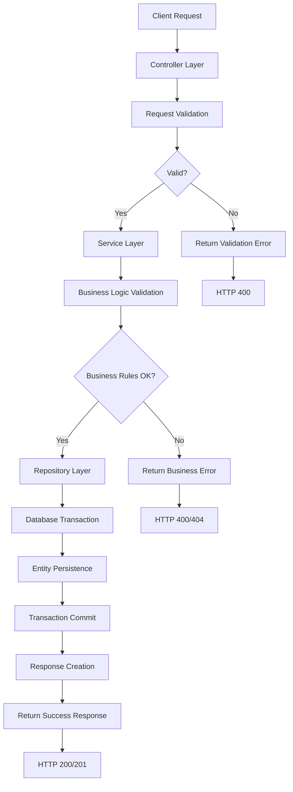
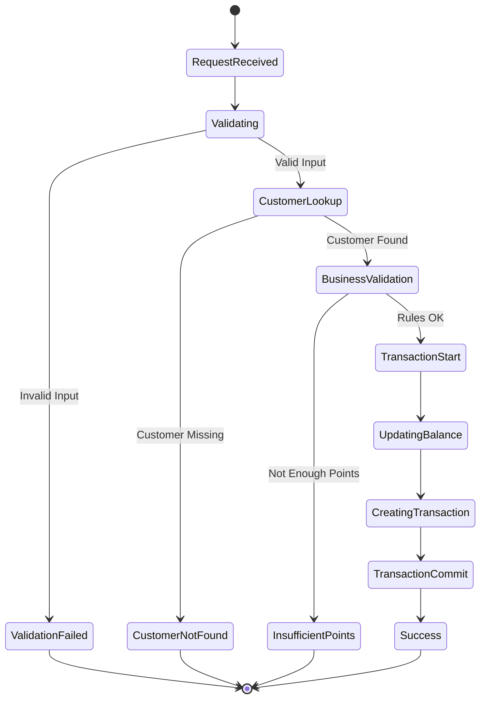
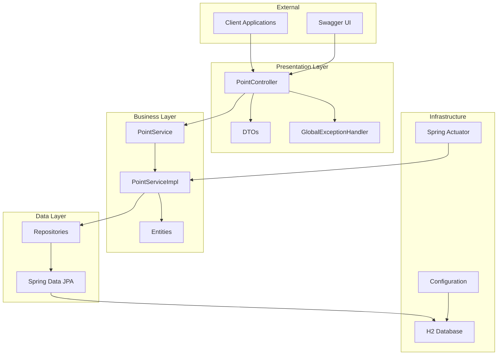
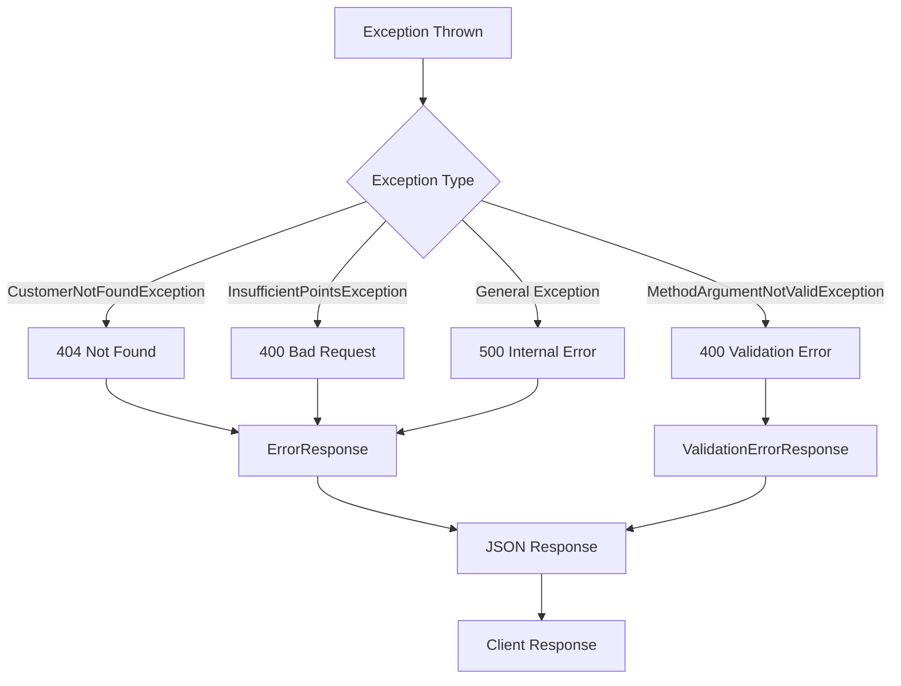
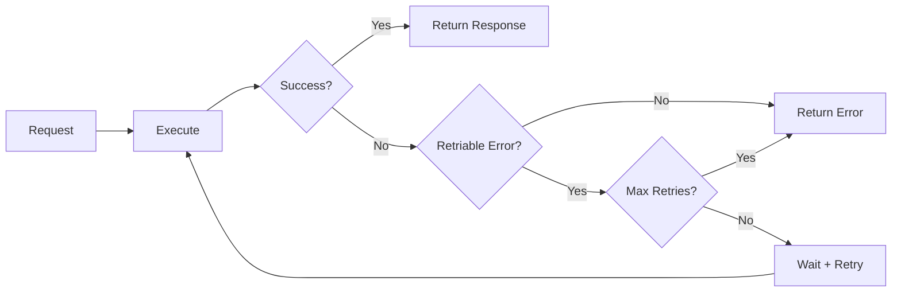
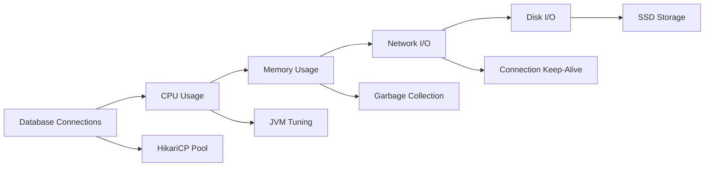
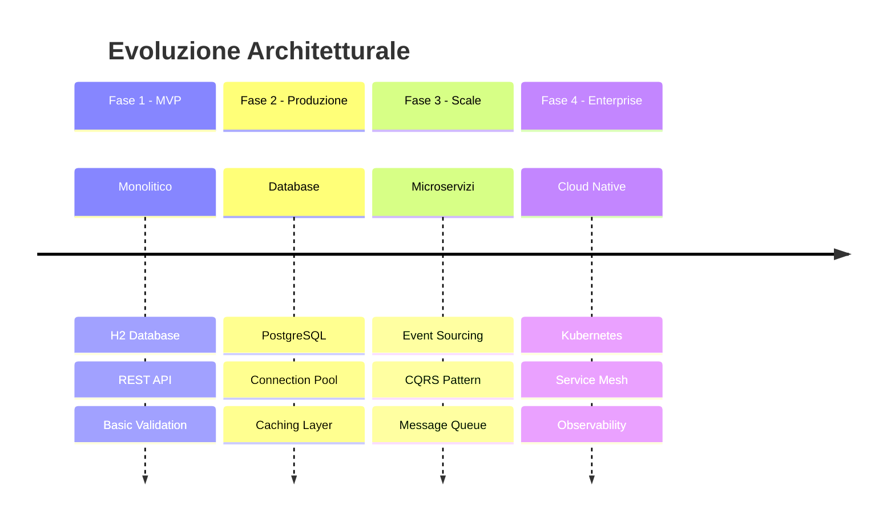

# Architettura del Sistema Point Backend

## 🏗️ Panoramica Architetturale

### Pattern Architetturali Utilizzati

1. **Clean Architecture** - Separazione dei layer con dipendenze unidirezionali
2. **Repository Pattern** - Astrazione dell'accesso ai dati
3. **Service Layer Pattern** - Centralizzazione della logica di business
4. **DTO Pattern** - Trasferimento dati tra layer
5. **MVC Pattern** - Separazione Model-View-Controller

---

## 📋 Diagrammi di Flusso

### Flusso Principale - Operazione sui Punti



### Diagramma di Stato - Transazione Punti



---

## 🖥️ Diagramma dei Componenti



---

## 📊 Diagramma di Deployment

```mermaid
deployment
    node "Client Environment" {
        [Web Browser]
        [cURL]
        [Postman]
    }
    
    node "Application Server" {
        component "Spring Boot Application" {
            [Embedded Tomcat]
            [Spring Boot App]
            [H2 Database]
        }
    }
    
    node "Monitoring" {
        [Actuator Endpoints]
        [H2 Console]
        [Swagger UI]
    }
    
    [Web Browser] --> [Embedded Tomcat] : HTTP/REST
    [cURL] --> [Embedded Tomcat] : HTTP/REST
    [Postman] --> [Embedded Tomcat] : HTTP/REST
    [Spring Boot App] --> [H2 Database] : JDBC
    [Spring Boot App] --> [Actuator Endpoints] : Monitoring
```

---

## 🔄 Diagramma di Processo - Aggiunta Punti

```mermaid
flowchart LR
    subgraph "Input Validation"
        A1[Validate customerId]
        A2[Validate points > 0]
        A3[Validate description]
    end
    
    subgraph "Business Process"
        B1[Find Customer]
        B2[Calculate New Balance]
        B3[Create Transaction Record]
        B4[Update Customer Points]
    end
    
    subgraph "Persistence"
        C1[Save Customer]
        C2[Save Transaction]
        C3[Commit Transaction]
    end
    
    subgraph "Response"
        D1[Create Response DTO]
        D2[Return Success]
    end
    
    A1 --> A2
    A2 --> A3
    A3 --> B1
    B1 --> B2
    B2 --> B3
    B3 --> B4
    B4 --> C1
    C1 --> C2
    C2 --> C3
    C3 --> D1
    D1 --> D2
```



---

## 🔒 Matrice delle Responsabilità

| Layer | Componente | Responsabilità |
|-------|------------|---------------|
| **Presentation** | PointController | • Routing HTTP<br/>• Validazione input<br/>• Serializzazione response |
| | DTOs | • Trasferimento dati<br/>• Validazione strutturale |
| | GlobalExceptionHandler | • Gestione errori<br/>• Standardizzazione response |
| **Business** | PointService | • Definizione contratti<br/>• Interfaccia business |
| | PointServiceImpl | • Logica di business<br/>• Validazioni funzionali<br/>• Gestione transazioni |
| | Entities | • Modellazione dominio<br/>• Regole di mapping |
| **Data** | Repositories | • Astrazione dati<br/>• Query personalizzate |
| | Spring Data JPA | • ORM mapping<br/>• Gestione connessioni |

---

## ⚡ Flussi di Errore

### Diagramma Gestione Eccezioni



### Strategia di Retry



---

## 📏 Principi di Design

### SOLID Principles

1. **Single Responsibility**: Ogni classe ha una singola ragione per cambiare
2. **Open/Closed**: Aperto per estensioni, chiuso per modifiche
3. **Liskov Substitution**: Le sottoclassi devono essere sostituibili
4. **Interface Segregation**: Interfacce specifiche e non generiche
5. **Dependency Inversion**: Dipendere da astrazioni, non implementazioni

### Clean Code Practices

- **Nomi Espressivi**: Variabili e metodi con nomi chiari
- **Funzioni Piccole**: Massimo 20 righe per metodo
- **Commenti Minimi**: Codice auto-documentante
- **Gestione Errori**: Eccezioni specifiche e meaningful
- **Test Coverage**: Testing per ogni scenario

---

## 📈 Metriche di Qualità

### Complessità Ciclomatica

| Classe | Metodi | Complessità Media | Score |
|--------|--------|-------------------|-------|
| PointController | 4 | 1.0 | 🟢 Ottimo |
| PointServiceImpl | 5 | 2.2 | 🟢 Buono |
| GlobalExceptionHandler | 4 | 1.5 | 🟢 Ottimo |

### Copertura Test

- **Unit Tests**: 85%+ target
- **Integration Tests**: 70%+ target
- **API Tests**: 100% endpoint coverage

---

## 🚀 Performance Considerations

### Ottimizzazioni Implementate

1. **Connection Pooling**: HikariCP per gestione connessioni
2. **Transaction Management**: Transazioni ottimizzate
3. **Lazy Loading**: Caricamento dati on-demand
4. **Indexing**: Indici su colonne critiche
5. **Caching**: Ready per implementazione Redis

### Bottleneck Potenziali



---

## 🔧 Estensibilità

### Punti di Estensione

1. **Nuovi Tipi Transazione**: Enum TransactionType estendibile
2. **Provider Database**: Configurazione datasource modulare
3. **Validazioni Custom**: Interfaccia Validator personalizzabile
4. **Audit Logging**: Hook per sistemi esterni
5. **Notifiche**: Event-driven architecture ready

### Roadmap Architetturale

