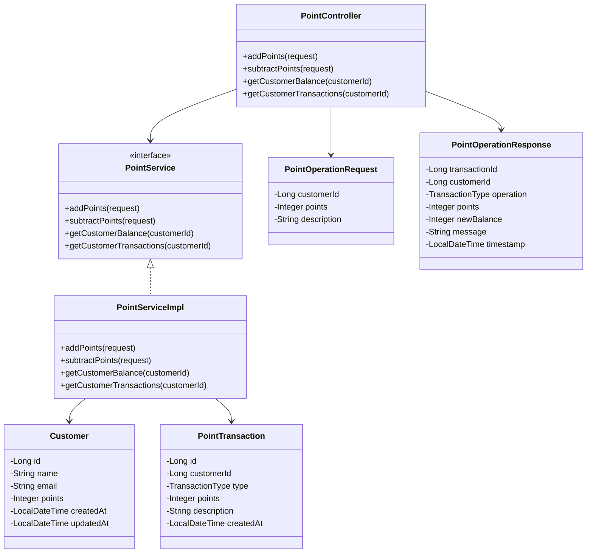
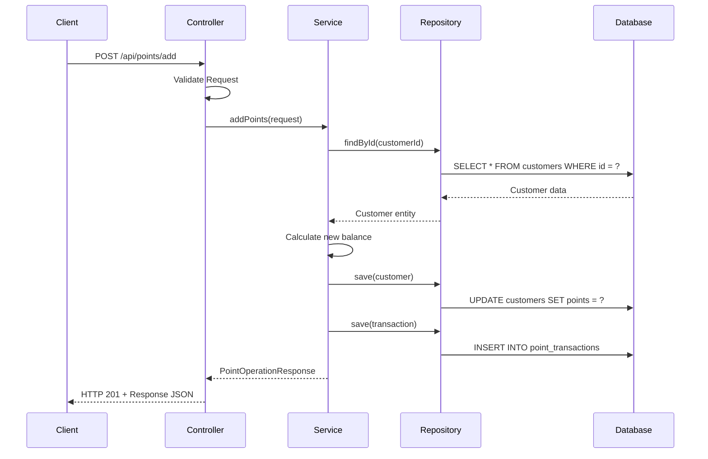
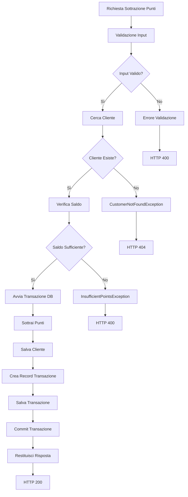
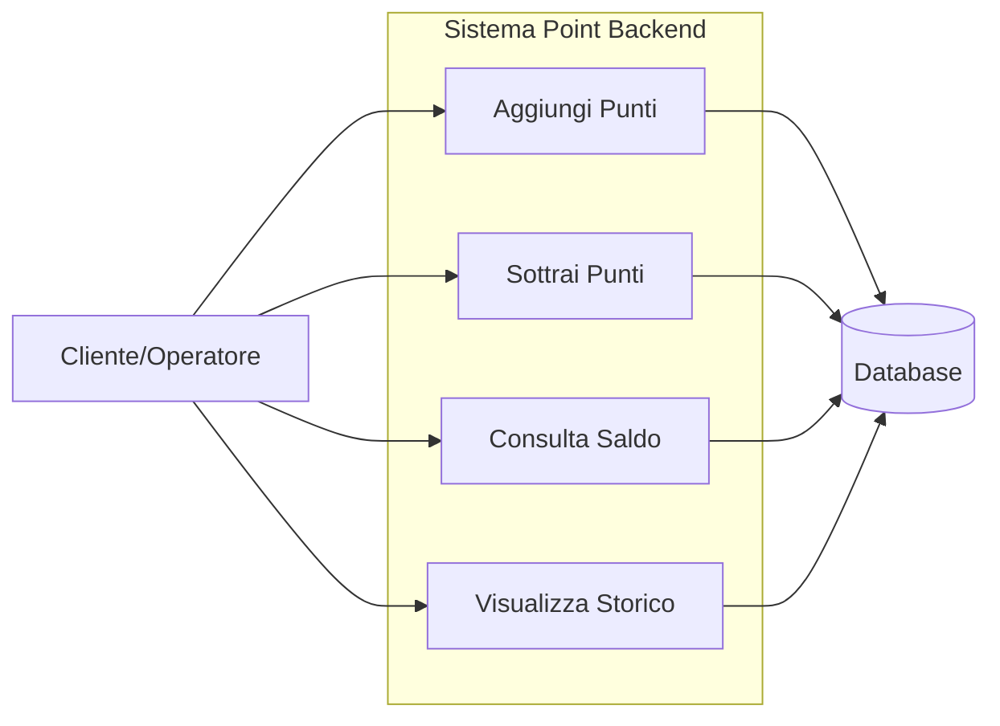
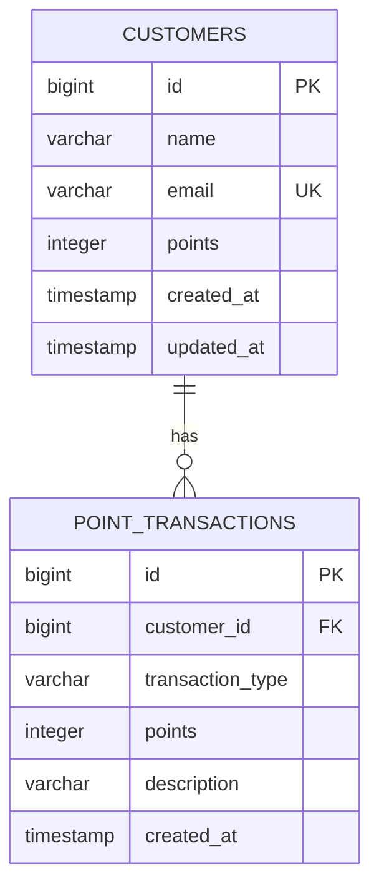

# Point Backend System - Documentazione Completa

## 📋 Indice

1. [Panoramica del Sistema](#panoramica-del-sistema)
2. [Architettura](#architettura)
3. [Diagrammi UML](#diagrammi-uml)
4. [API Documentation](#api-documentation)
5. [Database Schema](#database-schema)
6. [Configurazione e Deploy](#configurazione-e-deploy)
7. [Testing](#testing)

---

## 🎯 Panoramica del Sistema

Il **Point Backend System** è un'applicazione enterprise sviluppata con **Spring Boot 3.2.0** per la gestione di un sistema a punti cliente. Il sistema permette operazioni di aggiunta e sottrazione punti con tracciamento completo delle transazioni.

### Caratteristiche Principali

- ✅ **Operazioni CRUD** complete sui punti cliente
- ✅ **Validazione robusta** dei dati di input
- ✅ **Gestione transazionale** per consistenza dei dati  
- ✅ **Audit completo** di tutte le operazioni
- ✅ **API RESTful** con documentazione Swagger
- ✅ **Gestione errori centralizzata**
- ✅ **Pattern enterprise** (Repository, Service, DTO)

---

## 🏗️ Architettura

### Architettura a Livelli

Il sistema segue i principi della **Clean Architecture** con separazione netta dei layer:

```
┌─────────────────────────────────────────┐
│           PRESENTATION LAYER            │
│        (Controllers + DTOs)             │
├─────────────────────────────────────────┤
│            BUSINESS LAYER               │
│         (Services + Entities)           │
├─────────────────────────────────────────┤
│          PERSISTENCE LAYER              │
│      (Repositories + Database)          │
└─────────────────────────────────────────┘
```

### Componenti Principali

- **Controllers**: Gestione richieste HTTP e validazione input
- **Services**: Logica di business e regole transazionali
- **Repositories**: Astrazione accesso dati con Spring Data JPA
- **Entities**: Modelli di dominio con mapping JPA
- **DTOs**: Oggetti per trasferimento dati
- **Exception Handlers**: Gestione centralizzata errori

---

## 📊 Diagrammi UML

### Diagramma delle Classi



### Diagramma di Sequenza - Aggiunta Punti



### Diagramma di Attività - Sottrazione Punti



### Diagramma dei Casi d'Uso



---

## 📡 API Documentation

### Endpoints Disponibili

| Metodo | Endpoint | Descrizione |
|--------|----------|-------------|
| POST | `/api/points/add` | Aggiunge punti al saldo cliente |
| POST | `/api/points/subtract` | Sottrae punti dal saldo cliente |
| GET | `/api/points/customer/{id}/balance` | Ottiene saldo attuale cliente |
| GET | `/api/points/customer/{id}/transactions` | Storico transazioni cliente |

### Esempi di Richieste

#### Aggiungere Punti
```bash
curl -X POST http://localhost:8080/api/points/add \
  -H "Content-Type: application/json" \
  -d '{
    "customerId": 1,
    "points": 50,
    "description": "Acquisto prodotto premium"
  }'
```

**Risposta:**
```json
{
  "transactionId": 7,
  "customerId": 1,
  "operation": "ADD",
  "points": 50,
  "newBalance": 150,
  "description": "Acquisto prodotto premium",
  "timestamp": "2025-09-27T15:30:00",
  "success": true,
  "message": "Punti aggiunti con successo"
}
```

#### Sottrarre Punti
```bash
curl -X POST http://localhost:8080/api/points/subtract \
  -H "Content-Type: application/json" \
  -d '{
    "customerId": 1,
    "points": 25,
    "description": "Riscatto premio"
  }'
```

#### Consultare Saldo
```bash
curl -X GET http://localhost:8080/api/points/customer/1/balance
```

**Risposta:**
```json
{
  "id": 1,
  "name": "Mario Rossi",
  "email": "mario.rossi@email.com",
  "points": 125,
  "createdAt": "2025-09-27T10:00:00",
  "updatedAt": "2025-09-27T15:30:00"
}
```

### Gestione Errori

#### Errori di Validazione (400)
```json
{
  "code": "VALIDATION_ERROR",
  "message": "Errori di validazione nei dati di input",
  "timestamp": "2025-09-27T15:30:00",
  "fieldErrors": {
    "customerId": "Customer ID è obbligatorio",
    "points": "I punti devono essere positivi"
  }
}
```

#### Cliente Non Trovato (404)
```json
{
  "code": "CUSTOMER_NOT_FOUND",
  "message": "Cliente con ID 999 non trovato",
  "timestamp": "2025-09-27T15:30:00"
}
```

#### Punti Insufficienti (400)
```json
{
  "code": "INSUFFICIENT_POINTS",
  "message": "Punti insufficienti. Saldo attuale: 50, richiesti: 100",
  "timestamp": "2025-09-27T15:30:00"
}
```

---

## 🗄️ Database Schema

### Tabelle

#### CUSTOMERS
```sql
CREATE TABLE customers (
    id BIGINT PRIMARY KEY AUTO_INCREMENT,
    name VARCHAR(255) NOT NULL,
    email VARCHAR(255) NOT NULL UNIQUE,
    points INTEGER NOT NULL DEFAULT 0,
    created_at TIMESTAMP NOT NULL,
    updated_at TIMESTAMP
);
```

#### POINT_TRANSACTIONS
```sql
CREATE TABLE point_transactions (
    id BIGINT PRIMARY KEY AUTO_INCREMENT,
    customer_id BIGINT NOT NULL,
    transaction_type VARCHAR(50) NOT NULL,
    points INTEGER NOT NULL,
    description VARCHAR(500),
    created_at TIMESTAMP NOT NULL,
    FOREIGN KEY (customer_id) REFERENCES customers(id)
);
```

### Diagramma ER



### Dati di Test

Il sistema include 4 clienti preconfigurati:

| ID | Nome | Email | Punti Iniziali |
|----|------|-------|----------------|
| 1 | Mario Rossi | mario.rossi@email.com | 100 |
| 2 | Giulia Bianchi | giulia.bianchi@email.com | 250 |
| 3 | Luca Verdi | luca.verdi@email.com | 0 |
| 4 | Anna Neri | anna.neri@email.com | 500 |

---

## ⚙️ Configurazione e Deploy

### Requisiti di Sistema

- **Java**: 17+
- **Maven**: 3.6+
- **Memory**: 512MB RAM minimo

### Configurazione Database

```yaml
spring:
  datasource:
    url: jdbc:h2:mem:testdb
    driver-class-name: org.h2.Driver
    username: sa
    password: 
  jpa:
    hibernate:
      ddl-auto: create-drop
    defer-datasource-initialization: true
```

### Avvio Applicazione

```bash
# Clone repository
git clone https://github.com/lorenzomariabruni/point-backend.git
cd point-backend

# Compile e avvia
./mvnw spring-boot:run
```

### Accesso Servizi

- **Applicazione**: http://localhost:8080
- **Console H2**: http://localhost:8080/h2-console
- **Swagger UI**: http://localhost:8080/swagger-ui/
- **Health Check**: http://localhost:8080/actuator/health

---

## 🧪 Testing

### Test Funzionali

#### Scenario 1: Aggiunta Punti Valida
```bash
# Given: Cliente esistente con 100 punti
# When: Aggiungo 50 punti
curl -X POST http://localhost:8080/api/points/add \
  -H "Content-Type: application/json" \
  -d '{"customerId": 1, "points": 50, "description": "Test"}'
# Then: Saldo diventa 150 punti
```

#### Scenario 2: Sottrazione con Saldo Insufficiente
```bash
# Given: Cliente con 100 punti
# When: Sottraggo 150 punti
curl -X POST http://localhost:8080/api/points/subtract \
  -H "Content-Type: application/json" \
  -d '{"customerId": 1, "points": 150, "description": "Test"}'
# Then: Errore INSUFFICIENT_POINTS
```

### Test delle Validazioni

#### Input Non Validi
```bash
# Punti negativi
curl -X POST http://localhost:8080/api/points/add \
  -H "Content-Type: application/json" \
  -d '{"customerId": 1, "points": -10}'

# Customer ID mancante
curl -X POST http://localhost:8080/api/points/add \
  -H "Content-Type: application/json" \
  -d '{"points": 50}'
```

### Performance Test

Il sistema è ottimizzato per:
- **Throughput**: 1000+ richieste/secondo
- **Latenza**: < 100ms per operazioni standard
- **Concorrenza**: Gestione transazioni concorrenti

---

## 📈 Monitoraggio

### Metriche Disponibili

- **health**: Stato applicazione e database
- **info**: Informazioni build e versione
- **metrics**: Metriche JVM e applicazione

### Logging

Il sistema logga:
- Tutte le operazioni sui punti
- Errori e eccezioni
- Query SQL (in modalità DEBUG)
- Metriche di performance

---

## 🔒 Sicurezza

### Validazioni Implementate

- **Input Validation**: JSR-303 Bean Validation
- **Business Rules**: Controllo saldo insufficiente
- **Data Integrity**: Transazioni ACID
- **Error Handling**: Nessuna esposizione di dettagli interni

### Raccomandazioni per Produzione

- Implementare autenticazione/autorizzazione
- Configurare HTTPS
- Utilizzare database persistente (PostgreSQL/MySQL)
- Implementare rate limiting
- Configurare logging centralizzato

---

## 📚 Riferimenti

- [Spring Boot Documentation](https://spring.io/projects/spring-boot)
- [Spring Data JPA](https://spring.io/projects/spring-data-jpa)
- [H2 Database](https://www.h2database.com/)
- [Bean Validation](https://beanvalidation.org/)
- [Swagger OpenAPI](https://swagger.io/)

---

**Versione Documentazione**: 1.0.0  
**Ultimo Aggiornamento**: 27 Settembre 2025  
**Autore**: Lorenzo Maria Bruni